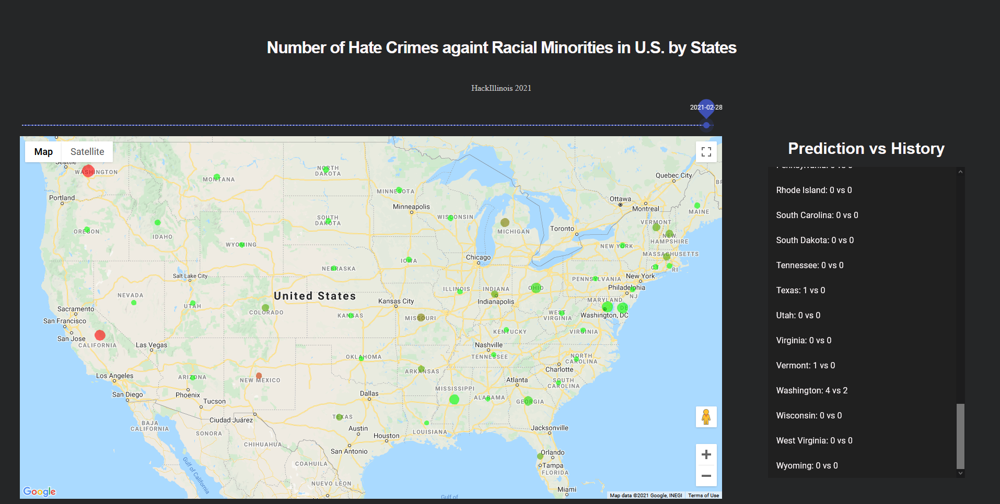

# Discrimination_Prediction

## Authors
- Soohyuck Cho
- Yoonjae Hwang
- Jongwoo Jeon
- Jihoon Kang
- Eunsun Lee
- Jinpyo Lee

## Motivation
With the emergence of the [novel coronavirus](https://www.who.int/csr/don/31-december-2020-sars-cov2-variants/en/), our society has witnessed soar in racial discrimination and hate crime since last year. Despite the governmental authority's continued effort to enforce [the Fourteenth Amendment](https://constitutioncenter.org/interactive-constitution/amendment/amendment-xiv), the law enforcement force is often inefficiently distributed and thus its efficiency in hate crime prevention is diminished. Thus, we propose a model to predict occurences of hate crimes to contribute to the efficient prevention of the hate crimes.

## Project Description
We first collect racial discrimination-related event instances with [New York Times API](https://developer.nytimes.com), especially the date, location and the respective occurences of the crimes. Based on the data collected, we train a deep learning model to predict occurences and locations of future possible discrimanation-related events. Our interactive dashboard enables users to intuitively compare the daily predicted number of crimes to the actual occurences in state levels.

## Deep Learning
We create a recurrent model that predicts the following week's hate crime occurences in state level, based on the previous 4 weeks' occurences by states. [Gated Recurrent Unit](https://arxiv.org/pdf/1412.3555.pdf?ref=hackernoon.com) was implemented instead of [Recurrent Neural Network](https://www.ibm.com/cloud/learn/recurrent-neural-networks) or [Long Short-Term Memory](https://www.bioinf.jku.at/publications/older/2604.pdf), to resolve vanishing gradient problem and take advantage of faster training time compared to the LSTM. The model takes a tensor (N X T X D) as input, where N = batch size, T = lookback weeks, D = Number of states, thus 50, and returns the tensor (N X D) as output. [Mean Squared Error loss](https://pytorch.org/docs/stable/generated/torch.nn.MSELoss.html) was used as a loss function, and the model was trained for 200 epochs.

## Technology and Skills
- Front-end, Back-end: Javascipt with [React](https://reactjs.org)
- Data Organization / Extraction / Classification :  
    * Articles filtering based on keywords
        - Collected press agencies: [New York Times](https://www.nytimes.com), [AP](https://apnews.com), [Reuters](https://www.reuters.com)
    * Extract Article data including publish date and incident location
- Deep Learning:
    * Implemented [PyTorch](https://pytorch.org) to create GRU model that predicts the number of hate crime occurences in each states.

## Dashboard Visualization

The dashboard enables intuitive comparison of the expected occurences and actual occurences. The size of the circle on each states represents the difference in magnitude of the actual weekly crime occurences and the expected weekly crime occurences. If the crime occurence is under-estimated (i.e. expected crime occurences is less than actual occurences), the circle is weighted towards green, thus representing safeness. On the other hand, if the crime occurence is over-estimated(i.e. expected crime occurences is more than actual occurences), the circle is weighted toward red, thus representing danger. If the expected occurence is equal to the actual number, the circle is colored neutral khaki.

With the silder on top of the map, user can easily adjust the timeframe to be looked into.

The expected and actual number of occurences for selected week is shown in the chart at right in alphabetic order.
